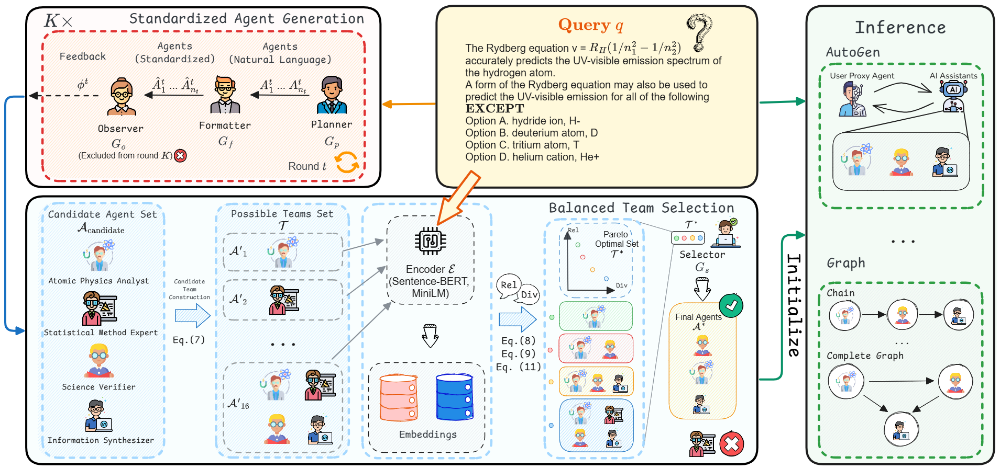

# AgentInit
## About Method

We propose ***AgentInit***, a novel initialization framework for large language model (LLM)-based multi-agent systems. AgentInit strategically orchestrates diverse agent roles and expertise distributions to optimize collaboration effectiveness and efficiency.





## **📣 News**

- **[20/08/2025] 🎉🎉Our paper is accepted by [EMNLP 2025 Findings]!🎉🎉**
- **[24/09/2024] Our paper is published on arXiv: [arXiv:2509.19236](https://arxiv.org/abs/2509.19236)!**
  
## **🛠️Requirements**

Install anaconda environment

```shell
conda create -n agentinit python=3.10

conda activate agentinit

pip install -r requirements.txt
```

Set url and API keys in `AgentInit/llm/gpt_chat`

```python
MINE_BASE_URL = ""

MINE_API_KEYS = ""
```

Set text encoder in `AgentInit/agentinit/embedder.py`

```python
model_path: str = ''
```

Prepare data from [Huggingface](https://huggingface.co/). And put them in `datasets/`.


## **🚀Quick Start **

Run AgentInit on MMLU, the same as other datasets: 

```shell
python -u experiments/run_mmlu.py --batch_size 10 --llm_name MODEL_NAME --agent_names AutoAgent
```


Run on different framework:

```shell
python -u experiments_Autogen/run_mmlu.py --batch_size 10 ---llm_name MODEL_NAME 
```


You can also try our pre-generated examples to quickly verify the evaluation results without running the full pipeline:

```shell
python -u example/run_mmlu.py --batch_size 40 --llm_name YOUR QWEN MODEL --agent_names AutoAgent
```

### Additional Benchmarks
For additional benchmarks and task-specific evaluation settings, please refer to the corresponding directories:

```shell
cd scienceworld
```
```shell
cd writing
```

## **📝 Citation**<a name="citation"></a>
If you find this repo useful, please cite our paper as:
```
@inproceedings{
tian2025agentinit,
title={AgentInit: Initializing {LLM}-based Multi-Agent Systems via Diversity and Expertise Orchestration for Effective and Efficient Collaboration},
author={Chunhao Tian and Yutong Wang and Xuebo Liu and Zhexuan Wang and Liang Ding and Miao Zhang and Min Zhang},
booktitle={The 2025 Conference on Empirical Methods in Natural Language Processing},
year={2025},
url={https://openreview.net/forum?id=j9y7YaxoG0}
}
```

Code framework based on [GPTSwarm](https://github.com/metauto-ai/GPTSwarm), [AgentPrune](https://github.com/yanweiyue/AgentPrune), [AgentDropout](https://github.com/wangzx1219/AgentDropout/) and [AutoAgents](https://github.com/Link-AGI/AutoAgents)
